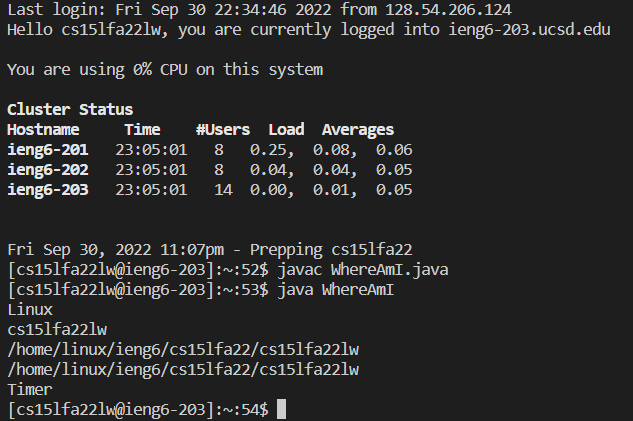

# HOW TO LOGIN TO YOUR REMOTE ACCOUNT (EASY) (NOT HARD)

What's good homies, I'm here to show y'all how to log into your course-specific `ieng6` account! This process should not be too bad (if you are not in a lab with a lot of other people trying to log in at the same time), so let's get into it!
***
## 1. INSTALL VISUAL STUDIO CODE
So the first thing you gotta do is install Visual Studio Code (also known as VSCode) onto your computer. If you already have it installed, you can skip this step. For the rest of you, click on this [link](https://code.visualstudio.com/) which should take you to the VSCode website, where you should see this screen: 
Select the appropriate installer for your system and follow the installation process. After installation, you should come up to this screen: 
Alright! Now you are ready to proceed to step 2!
***
## 2. RESET/SETUP PASSWORD AND SSH LOGIN
So now you got VSCode up and running, cool! It's time to connect to your `ieng6` account! But wait, we first gotta reset the password for the account, we're gonna need it to log in. First, go to the UCSD account lookup [here](https://sdacs.ucsd.edu/~icc/index.php) and enter your UCSD account details so that you can find your CSE 15L `ieng6` account. After that, you should be on this screen: 
The first box in the "Additional Accounts" section is your CSE 15L username. Click on the _change your password_ button and you should arrive at this screen: 
Here, use your CSE 15L username from the previous screen so that you can change its password. You should arrive at this screen: 
Here, type out your current password that you use for TritonLink, and make up whatever password you want for your account (as long as it meets the requirements). Make sure you set the **Change MyTritonLink password** option to "No" (unless you want to change your MyTritonLink password). Finally, after writing your new password, do **NOT** hit the "Check Password" button, but instead hit the "Enter" key to save your new password. You should be taken to the success screen (or a white screen if AdBlock is enabled). 

At this point, wait at least 15 minutes for your password to register in the system. For me, it took around 1 hour due to the large amount of students resetting their passwords at the same time. 

Now, it's time to actually log in into your `ieng6` account. For Windows users, you need to install the [Open SSH](https://docs.microsoft.com/en-us/windows-server/administration/openssh/openssh_install_firstuse) **client** first. Now, open up VSCode. Then you have 2 options to access the terminal:

Option 1: Go to the top left area, click on "Terminal", then click on "New Terminal".

Option 2: Use CTRL + ` at the same time.

In the terminal, type out the following code, with the `zz` being replaced by the letters in your account: 

`ssh cs15lfa22zz@ieng6.ucsd.edu`

Since this is (probably) your first time connecting, you will get an "authenticity of host" message, which you should type and enter "yes" to. After that, enter your password. If it works, this is the screen you should get: 
Now, if you do **not** make it to this screen, here is a [Google Doc](https://docs.google.com/document/d/1hs7CyQeh-MdUfM9uv99i8tqfneos6Y8bDU0uhn1wqho/edit) that has additional steps for fixing up your password. For the guys that logged in successfully, you can proceed to Step 3.
***
## 3. REMOTE COMMANDS
Ok, now let's try some commands! Here are some basic commands you can try:
``` 
cd
cd ~
ls
ls -lat
ls -a
mkdir (put name of custom directory here)
```
Here are some commands I did: 
You can see the effects of the commands, like how `ls` shows your files and directories, `cd` takes you through a directory, and `cd ~` takes you back to the home directory.
***
## 4. MOVING FILES
So I heard you wanna move some spicy stuff to your remote account eh? Well guess what, I got the perfect command for you! It's called `scp`, and for this scenario, we are going to return to the client (aka your computer). To exit the remote server, you can type and enter `exit`, or use CTRL + D.

In VSCode, make a new file called `WhereAmI.java`, and copy and paste this code:
```
class WhereAmI {
  public static void main(String[] args) {
    System.out.println(System.getProperty("os.name"));
    System.out.println(System.getProperty("user.name"));
    System.out.println(System.getProperty("user.home"));
    System.out.println(System.getProperty("user.dir"));
  }
}
```
Use `javac` and `java` commands to compile and run your program, and you should see your computer's details. Now, you need to run this command, replacing the `zz` with your account letters:

`scp WhereAmI.java cs15lfa22zz@ieng6.ucsd.edu:~/`

Type in your password again, and you should have successfully sent your file to the remote server! Now `ssh` into the remote server again, and run `javac` and `java`. Here is what I got:

***
## 5. SSH KEY
Are you tired of typing your password over and over again? Guess what, an **SSH** key will help a lot! To generate a **SSH** key, run this command on the terminal:
`ssh-keygen`

For the file path it asks you to save the key to, just press "enter" for the default path it gives you. It will also ask you to make a passphrase, but for this you can leave it empty for no passphrase. Keep note of your public key's path, as you will need it to send your **SSH** key to the remote server. For Windows users, [here](https://learn.microsoft.com/en-us/windows-server/administration/openssh/openssh_keymanagement#user-key-generation) are extra steps to follow for **SSH** key generation.

Log into the remote server again, and this time use the `mkdir .ssh` command to make an **SSH** directory for the remote server. Log out of the server, and then use the following command to send your public **SSH** key to the server, replacing for your username and public key:

`scp /Users/joe/.ssh/id_rsa.pub cs15lfa22@ieng6.ucsd.edu:~/.ssh/authorized_keys`

After this, you can login to the remote server without needing a password!

***
## 6. BECOMING A REMOTE SPEEDRUNNER
So you wanna become a remote speedrunner eh? Unfortunately, I do not have many tricks to increase your efficiency at logging in, but there are some hotkeys you can use to speed up the process. 

Remember Part 2 where you had 2 options for opening the terminal? Well, you will need to use the hotkeys CTRL + ` so that you can just boot up VSCode and immediately have your terminal ready to go. This should shave off a couple seconds from your login. 

Another (and my final) trick you can use is within the terminal, you can use the "up" and "down" keys to quickly recall the last command you used in the terminal. If you know that you used `ssh` in the last few commands, you can "up" key a few times to get to that command, which should be faster than having to type out your entire username.

Thanks for reading!