# WEEK 3 LAB REPORT BY YOURS TRULY
## Part 1: Simplest Search Engine + Errors
Here's my attempt at creating a search engine (only some of it works):
```
import java.io.IOException;
import java.net.URI;
import java.util.ArrayList;

class SearchHandler implements URLHandler{

    ArrayList<String> searches = new ArrayList<>();
    public String handleRequest(URI url) {
        if (url.getPath().equals("/")) {
            return String.format("What are you waiting for? Search already!");
        } 
        else if (url.getPath().contains("/add")) {
            String[] param = url.getQuery().split("=");
            if (param[0].equals("s")) {
                    searches.add(param[1]);
                    return String.format("Search term successfully added!");
            }
        }
        else if (url.getPath().contains("/search")) {
            String[] param = url.getQuery().split("=");
            if (param[0].equals("s")) {
                ArrayList<String> result = new ArrayList<>();
                for (String s: searches) {
                    if (searches.contains(s)) {
                        result.add(s);
                    }
                }
                return String.format("Searches: %s", result.toString());
            }
        }
        return "404 Not Found!";
    }
}
class SearchEngine {
    public static void main(String[] args) throws IOException {
        if(args.length == 0){
            System.out.println("Missing port number! Try any number between 1024 to 49151");
            return;
        }

        int port = Integer.parseInt(args[0]);

        Server.start(port, new SearchHandler());
    }
}

```

Here's the default/root path for the search engine (it really wants you to search for something):
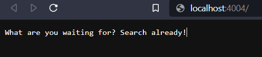
``` 
if (url.getPath().equals("/")) {
            return String.format("What are you waiting for? Search already!");
        } 
```
In the root path, you can either add a `/` to the path or leave it as is to get to the default case. If you add anything to the `/` that is not an add or a search, you will get a `404 Not Found!` error.

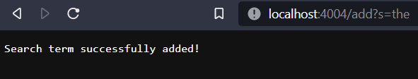
Hooray! I added a search term to the list of searches!
```
else if (url.getPath().contains("/add")) {
            String[] param = url.getQuery().split("=");
            if (param[0].equals("s")) {
                    searches.add(param[1]);
                    return String.format("Search term successfully added!");
            }
```
To add a search term to the list of searches, you need to type in `/add?s={the term you want to add}` into the url. In the code block above, the `if` statement will be true if the first parameter is specifically `s`. After that, the `searches` list will add the next parameter (in this case the search term you want to add) to the array. Finally, `Search term successfully added!` will be returned and printed onto the front of the web page. For example, if I want to add "apple" into the searches, I would type in `/add?s=apple`, and "apple" would be added, with the success message on the screen.

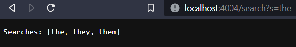
Hooray! I have searched for a substring successfully and got expected results.
```
else if (url.getPath().contains("/search")) {
            String[] param = url.getQuery().split("=");
            if (param[0].equals("s")) {
                ArrayList<String> result = new ArrayList<>();
                for (String s: searches) {
                    if (searches.contains(s)) {
                        result.add(s);
                    }
                }
                return String.format("Searches: %s", result);
            }
        }
```
To search, type in a word or a combination of letters using `/search?s={type your word/combination of letters here}`. The `if` statement checks that you used "s" as the first parameter, and after it comes true, a new ArrayList will be created called `result`. `result` will store all successful searches and be printed onto the webpage. The `for` loop will check the `searches` list and see if each element contains the substring you put into the query. Each element with the substring will be added to `result`, and after all elements have been searched, the `return` statement will execute and print out "Searches: " and the searched terms.

## Part 2: Supreme Debugging
So there are 2 methods in 2 files (so 1 method per file) that I need to test and debug. The ones I will be debugging are ReverseInPlace in ArrayExamples.java, and Filter in ListExamples.java. 

ReverseInPlace is supposed to reverse the order of all the elements in the input array without needing to make a new array. However, there are multiple issues that prevent the method from working properly. Here is the test from ReverseInPlace that failed, and the input I used: 
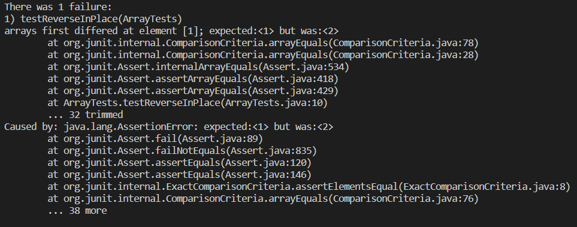
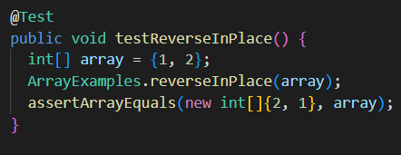

Here is ReverseInPlace's buggy code:
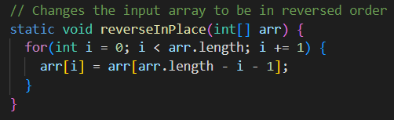

There are multiple bugs in this method. First of all, `reverseInPlace` is missing necessary code to make proper swaps within the input array. The second problem is that the `for` loop iterates through the entire array, meaning that the method will swap elements back to their original indices after the loop reaches half of the array's length. 

To solve this issue, I added 2 lines of code that will allow the method to swap elements without overwritting any elements, and I also divided the array length by 2 to make sure the loop stops halfway through the array.

Here is the fixed code and passing test:
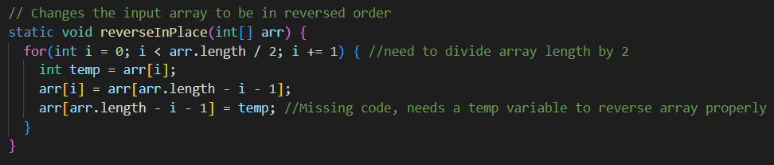
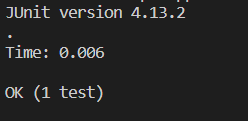


Now let's move on to the Filter method. This method is supposed to use the StringChecker to see if the string elements in an input array meet the StringChecker's requirements and put them into a new array in the same order. However, there is one slight error that causes the new array to be out of order. Here is the failing test and input:
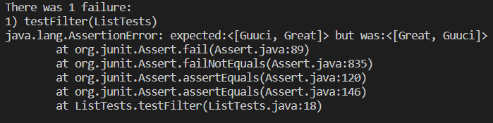
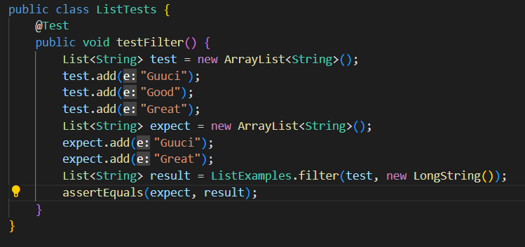

Here is Filter's buggy code:
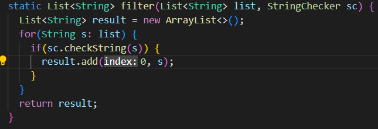

The bug in this code is that the method adds to the new array at a specific index, 0. New elements added to that index pushes the previous elements up by 1 index, which ultimately causes the array to be out of order.

To fix this issue, I looked at other addition method calls I could use, and found that I did not need to specify an index. This makes the method add elements at the end of the array, so it will not push existing elements up by 1 index.

Here is the fixed code and passing test:
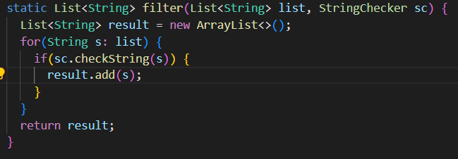
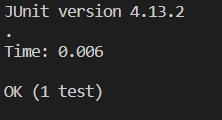