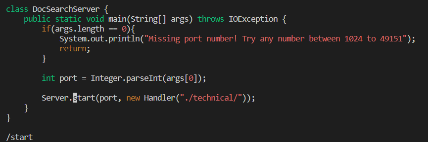
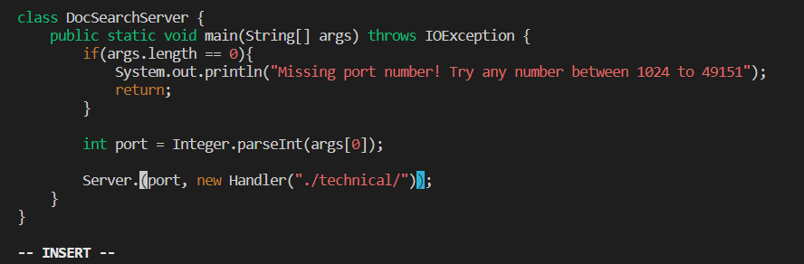
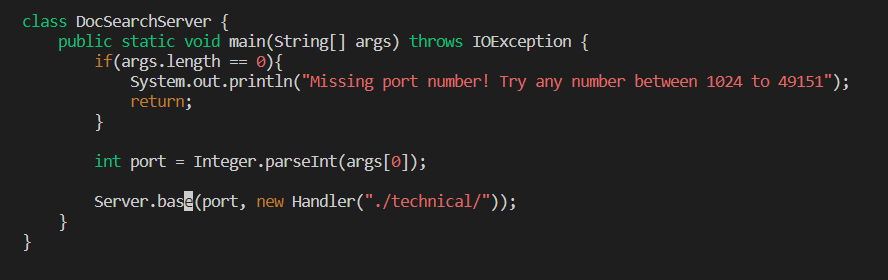
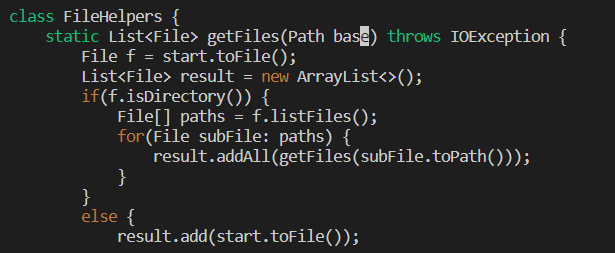
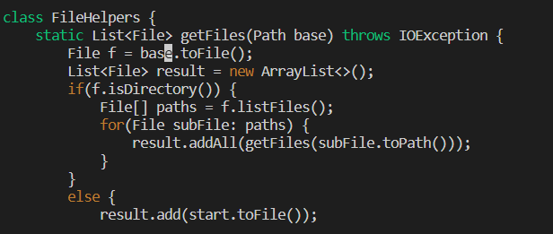
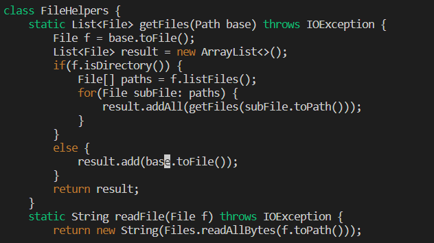

# It's Vimming Time
What is up coders, today I will be doing lots of Vim! I will be taking an existing `java` file and modifying it using Vim.

## Part 1
The file I will be modifying is DocSearchServer.java, and the edit I will make is replacing every instance of `start` with `base`.

/start\<Enter>

`/start` searches for the first instance of the word "start" and `<Enter>` takes the cursor to the first letter of that word. It takes 7 keystrokes for these commands.

cw

`c` switches the mode to insert and `w` deletes the word "start". It takes 2 keystrokes.

“base”\<ESC>

4 keystrokes to enter the word "base" and 1 keystroke to exit out of Insert mode, so 5 keystrokes for these commands.

n and . 3 times

`n` takes the cursor to the next usage of the word "start" and `.` repeats the previous change made, which in this case was replacing the word "start" with "base". This takes 2 keystrokes, and since these 2 commands are done 3 times (because there are 3 more instances of "start"), it will take 6 keystrokes for these commands.

“:x”\<Enter> to save the changes and exit Vim. This will take 3 keystrokes to do. I use `:x` since it takes 1 less keystroke than `:wq`. 

In total, I used 23 keystrokes to change each use of the "start" parameter to "base".

## Part 2
In this part, I will be timing myself in editing the same file in 2 different ways. The first method is to use VSCode locally and `scp` the file to the remote server and run the `test.sh` script there. The second way is to `ssh` to the remote server, use Vim to make my edits, and run the script there. It took 46 seconds for the first way, and 24 seconds for the second way. 

Comparing the time difference, I would prefer to use the Vim method because it is significantly faster than the first method. In addition, Vim has commands that help me make edits more easily than in VSCode, so I would primarily use Vim to make changes. However, if the project/task I am working on involves unfamiliar concepts, I would use VSCode because it comes with auto-completion for methods, which allows me to explore the different functions I can use to complete the task.

